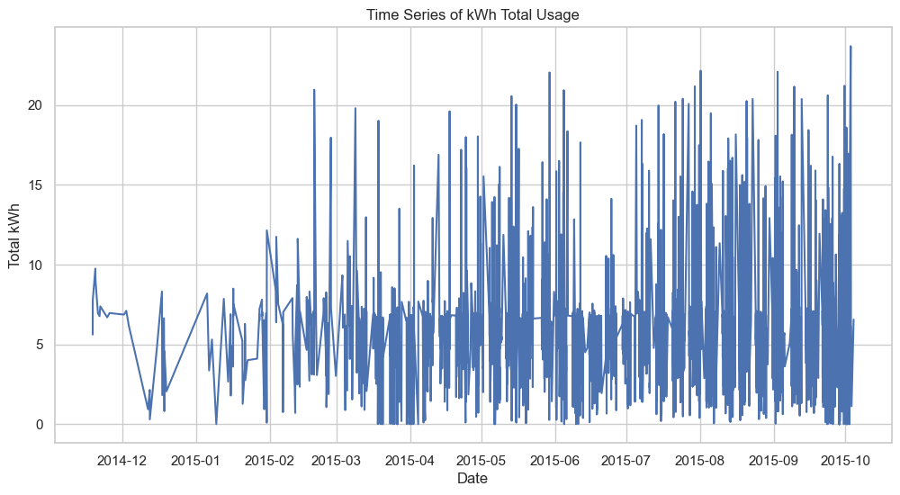
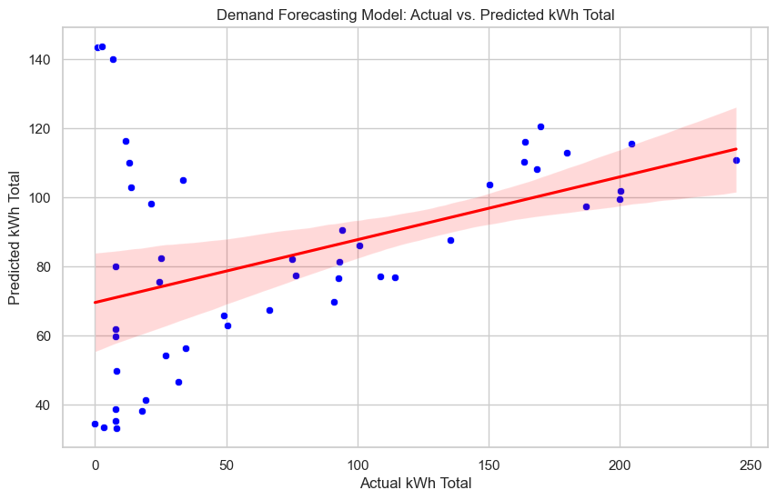

[![LinkedIn][linkedin-shield]][linkedin-url]

# Optimizing EV Charging Station Performance through Predictive Analytics and Simulation
Showcase strong interest in stable auto and personal skills


## Project Objective:
Develop a comprehensive analysis and simulation model to predict and improve EV charging station performance, optimize operations, and enhance revenue generation strategies.

## Built-with: 
* Python[3.12.3] 
    * Pandas[2.2.2]
    * Numpy [1.26.4]
    * Scikit-learn [1.4.2]
    * Simpy [4.1.1]

## Project Outline: 
I. Data Preparation and Exploration 
  * Data Cleaning: Process dataset to handle missing values, correct anomalies, and prepare it for analysis.
  * Exploratory Data Analysis: Use visualizations to understand the data’s underlying patterns, distributions, and correlations.
    
II. Predictive Modeling
  * Demand Forecasting Model: Build a machine learning model to predict daily usage patterns and demand at EV charging stations. Techniques include time series analysis(linear and ARIMA) and regression models.
  * Performance Prediction Model: Develop a model to predict the energy consumption of charging stations.
    
III. Simulation of Charging Station Operations
  * Capacity Planning: Use simulations to model scenarios where demand may exceed supply, and identify the impact of adding more charging stations.
  * Pricing Strategy Simulation: Simulate different pricing models to find the optimal balance between usage and revenue.
    
IV. Data Pipeline and Monitering 
  * Data Pipeline Design


## Dataset 
This [dataset](https://dataverse.harvard.edu/dataset.xhtml?persistentId=doi:10.7910/DVN/NFPQLW) contains information from 3,395 high resolution electric vehicle charging sessions. The data contains sessions from 85 EV drivers with repeat usage at 105 stations across 25 sites at a workplace charging program. The workplace locations include facilities such as research and innovation centers, manufacturing, testing facilities and office headquarters for a firm participating in the U.S. Department of Energy (DOE) workplace charging challenge. The data is in a human and machine readable *.CSV format. The resolution of the data is to the nearest second, which is the same resolution as used in the analysis of the paper. It is directly importable into free software. (2020-07-30)

| Columns        | Description                                                                                                         |
|----------------|---------------------------------------------------------------------------------------------------------------------|
| sessionId      | Charging session ID                                                                                                 |
| kwhTotal       | Total energy use (kWh)                                                                                              |
| dollars        | Amount paid by user (USD)                                                                                           |
| created        | Charge start date and time (00YY-MM-DD HH:MM:SS)                                                                    |
| ended          | Charge end date and time (00YY-MM-DD HH:MM:SS)                                                                      |
| startTime      | Charge start hour (military time)                                                                                   |
| endTime        | Charge end hour (military time)                                                                                     |
| chargeTimeHrs  | Total charge time (hr)                                                                                              |
| weekday        | Day of week                                                                                                         |
| platform       | Platform used to log session information by EV user                                                                 |
| distance       | Distance from a user's home to the charging location, expressed in miles except where user did not report address   |
| userId         | User ID                                                                                                             |
| stationId      | Station ID                                                                                                          |
| locationId     | Location ID                                                                                                         |
| managerVehicle | Firm manager vehicle indicator                                                                                      |
| facilityType   | Type of facility a station is installed at (manufacturing = 1, office = 2, research and development = 3, other = 4) |
| Mon            | Monday indicator                                                                                                    |
| Tues           | Tuesday indicator                                                                                                   |
| Wed            | Wednesday indicator                                                                                                 |
| Thurs          | Thursday indicator                                                                                                  |
| Fri            | Friday indicator                                                                                                    |
| Sat            | Saturday indicator                                                                                                  |
| Sun            | Sunday indicator                                                                                                    |
| reportedZip    | Zip provided by user indicator                                                                                      |

## Dataset Preparation and Exploration 
1. Converting data and time fields to python datetime 
    * 'created' and 'ended' 
    * The year column in the time is wrong i.e. "0014-11-18 15:40:26" should actually be 2014 rather than 0014 (Also for 0015 as well)

2. Check for missing values
    * 'distance' is the distance from a user's home to the charging location, expressed in miles except where user did not report address
    * We see that the only column that has missing/null values is the column 'distance' which is expected as this is a user-reported data. We have a few ways to go at this:
      1. leave as-is
      2. fill with placeholder 
      3. impute values 
          * mean/median imputation
          * model based imputation 
      4. remove entries

For now I will choose to leave as-is because it's not critical for my primary analysis/simluations. This avoids introducing potential biases. 

3. Feature Engineering
     * We do see that a lot of features such as day of the week and hour are available so I will leave this as is for now.

## EDA 

### Histogram for distribution of key metrics for 'kwhTotal' and 'chargeTimeHrs'


#### Key Observations(kWh)
1. Shape
   * The distribution is heavily skewed to the right, with a peak around 2-3 kWh and a long tail extending to higher kWh values. This suggests that most charging sessions involve small amounts of energy, with fewer sessions consuming more energy.
2. Central Tendency
   * The mode of the distribution (the most frequent value) is around 2-3 kWh, indicating that this is a common amount of energy drawn during a session.
3. Variability
   * There is significant variability in the distribution, as indicated by the long tail. Some charging sessions consume substantially more energy than the typical amounts.

#### Key Observations (Charge Time)
1. Shape
   * The distribution of charging time is also right-skewed, with a peak around 1-2 hours and a tail extending to longer durations.
2. Central Tendency
   * Most charge times are short, with the mode between 1-2 hours.
3. Variability
   * There is a presence of outliers or sessions that last significantly longer than the typical 1-2 hours, though these are less frequent.


### Time series graph for 'kwhTotal' trends over time.


#### Key Observations
1. Seasonal Trends:
   * There appears to be a cyclic pattern in the data, with fluctuations that might suggest seasonal trends. This could indicate higher usage in certain months, possibly influenced by weather conditions, holiday seasons, or other seasonal factors.
2. Volatility:
   * The data shows significant volatility in daily kWh usage, with some days experiencing very high usage and others much lower. This variability might require careful management of charging infrastructure to ensure it can handle peak demands.
3. Growth Over Time:
   * There seems to be an upward trend in the latter part of the series, particularly noticeable starting around mid-2015. This could be indicative of an increase in the adoption of EVs, expansion of charging infrastructure, or both.
4. Dips and Peaks:
   * Specific notable dips and peaks could be linked to external events (e.g., holidays, special promotions, or temporary outages/disruptions at charging stations). For instance, the sharp dips around early 2015 might warrant further investigation to understand underlying causes.

### Distribution of 'kwhTotal' across days of the week.


#### Key Observations
1. Variability and Median Values:
   * Tuesday through Friday show similar median kWh usage values, with Tuesday and Wednesday having slightly lower variability in kWh usage as indicated by the shorter interquartile ranges (IQR). This suggests a more consistent usage pattern mid-week.
   * Monday and Thursday display a slight increase in median kWh usage compared to mid-week but also show a bit more variability, especially Thursday.
   * Saturday and Sunday show significantly higher variability in kWh usage with higher median values, particularly on Sunday. Sunday shows not only the highest median kWh usage but also the broadest range of kWh usage, as indicated by the longer box and more spread out outliers.
2. Outliers:
   * There are numerous outliers on most days, but particularly on Sunday. Outliers are data points that fall far from the central cluster of data (outside 1.5 * IQR from the upper or lower quartile), indicating unusually high or low kWh usage on these days.
   * The presence of outliers, especially on weekends, suggests that there can be extreme variations in usage, possibly due to non-routine activities or events.
3. Spread and Dispersion:
   * The weekend (Saturday and Sunday) boxes are not only taller (indicating a higher IQR, thus more variability among data points) but also show the tails (whiskers) extending further from the median than on weekdays. This could imply less predictability in usage patterns during these days.
   * The relatively compact boxes from Tuesday to Friday suggest more consistent usage patterns on these days.

### Correlation heatmap to examine correlation between numeric features.


#### Key Observations
1. kWhTotal and chargeTimeHrs (0.53):
   * This moderate positive correlation suggests that as the charge time increases, the total kWh delivered also tends to increase, which is expected since more time charging generally results in more energy being delivered.
2. endTime and chargeTimeHrs (0.12):
   * A low positive correlation indicates that there's some relationship between the time when the charging ends and the total duration of charging, but other factors likely influence the end time as well, such as the time of day when the charging started.
3. facilityType and several days of the week (ranging from -0.07 to 0.35):
   * These correlations might suggest varying usage patterns on different days of the week depending on the facility type. For instance, certain facilities might see more use during weekdays if they are near workplaces.
4. Negative correlations in managerVehicle with several other variables (e.g., -0.17 with chargeTimeHrs):
   * This could indicate that vehicles associated with a manager (possibly company vehicles) might have different usage patterns compared to personal vehicles, perhaps adhering to specific operational constraints or usage timings.

## Predictive Modeling

1. Performance Prediction Model


* MAE = 1.66
* MSE = 10.00
* R² = -0.31

Analysis:
* MAE and MSE: The MAE and MSE values appear relatively low, but this assessment really depends on the scale of your target variable (kWh). If the typical values of your target are large, these errors might be acceptable.
* R²: The negative R² indicates that the model performs worse than a horizontal mean line. This is a sign that the model is not capturing the underlying pattern and might be poorly specified or using non-relevant features.

Improvements:
* Feature Engineering: Investigate adding more relevant features or transforming existing features to capture non-linear relationships.
* Model Complexity: Consider using more complex models that can capture more complex patterns in the data, such as random forests or gradient boosting machines.
* Data Quality: Ensure the data quality is high and check for any data preprocessing issues like outliers or incorrect data entries that could be influencing model performance.


2. Demand Forecasting with Simple Linear Regression



* MAE = 52.00
* MSE = 4170.05
* R² = 0.17

Analysis:
* MAE and MSE: These values are high, indicating that on average, the model’s predictions are off by 52 kWh, with some errors squared, leading to a higher MSE. Given the typical scale of daily kWh demand, these errors might be significant.
* R²: The value of 0.17 suggests that only 17% of the variance in the kWh total is being explained by the model, which is quite low. This indicates a poor fit.

Improvements:
* Model Type: Linear regression may be too simplistic to capture the dynamics in the kWh data, especially if there are non-linear relationships.
* Additional Features: Include time-based features like day of the week, holidays, or weather conditions, which can impact energy usage.
* Higher-Order Terms: Try polynomial regression or interaction terms to capture more complex relationships.

3. Demand Forecasting with ARIMA


* MAE = 73.12
* MSE = 7324.85
* RMSE = 85.59

Analysis:
* MAE and RMSE: The MAE and RMSE are quite high, which indicates significant forecasting errors. Given that these values are likely to represent daily totals, errors of this magnitude can be quite impactful.
* Model Fit: The high errors suggest that ARIMA may not be capturing all the relevant patterns, particularly if there is seasonality or non-stationary behavior in the dataset that hasn't been addressed adequately.

Improvements:
* Check Stationarity: Revisit the stationarity assumption and make sure the data are properly differenced to achieve stationarity.
* Seasonal Model: If there is seasonality, consider using a SARIMA model which incorporates both non-seasonal and seasonal elements.
* Model Diagnostics: Review the residuals of the ARIMA model for any patterns that suggest poor model fit and adjust the model parameters accordingly.


## Simulation of Charging Station Operations ## 
* Didn't have much time to complete this part fully but wrote up what I have in mind *

We can simulate using the historical data we have from our original dataframe. Here are some important numbers to keep in mind: 
* Average number of sessions per hour: 2.2088484059856865
* Average charge duration: 170.48925871379478 minutes
* Standard deviation of charge duration: 90.4483147118524 minutes

We can then use these metrics create a simple simulation using packages in Python such as [Simpy](https://simpy.readthedocs.io/en/latest/). Simpy is great for simulating variables with discrete distributions.

For the simulation we can get these outputs using the methods listed: 
1. Arrival Times - Exponential Distribution
   * Given that vehicle arrivals at charging stations can be reasonably assumed to be independent events with a constant mean rate, using the exponential distribution is justified.
2. Charge Duration: Normal Distribution
   * Central Limit Theorem: This theorem suggests that when independent random variables are added, their properly normalized sum tends toward a normal distribution even if the original variables themselves are not normally distributed. In most situations, the total charge time can be affected by small independent factors; battery level, charger type, etc... however, these can all be approximated by a normal distribution.

We can build something simple like this at first to take an initial stab at simulating with our parameters.

```
import simpy
import random

def ev_charging_station(env, number_of_chargers, arrival_rate):
   """Simulation of charge station"""
    charger = simpy.Resource(env, number_of_chargers)
    
    while True:
        yield env.timeout(random.expovariate(arrival_rate)) # Exponential distribution with Arrival times
        env.process(vehicle(env, charger))

def vehicle(env, charger, mean_duration, std_duration):
    """Simulate the charging process of a single vehicle"""
    with charger.request() as request:
        yield request
        charge_duration = random.normalvariate(mean_duration, std_duration)  # Normal distribution with Charge duration
        yield env.timeout(charge_duration)

env = simpy.Environment()
env.process(ev_charging_station(env, number_of_chargers=2, arrival_rate=1/arrival_rate_per_hour))
env.run(until=1440)  # Simulate for one day (1440 minutes)

```
## Data Pipeline and Monitering 
Assuming from the job description, the application will be utilizing RESTAPI's to grab data. I have built a sketch of a possible solution for utilizing AWS services to create a robust and scalable solution. This architecture will be able to handle the data flow from the source to storage and analysis. 

Components:
* API Gateway: Use AWS API Gateway to manage, secure, and route API calls.
* AWS Lambda: Process API requests by executing the business logic and interacting with other AWS services for data handling.
* Amazon S3: Use as the primary data lake storage for raw data collected from the API.
* AWS Glue: Perform ETL operations on the data stored in S3 to transform it into a structured format suitable for analysis.
* Amazon RDS or Amazon Redshift: Serve as the data warehousing solution to store and manage transformed data.
* Amazon QuickSight: Provide business intelligence capabilities by allowing visualization and reporting on the processed data.
* Amazon CloudWatch: Monitor the performance of all components, especially API Gateway and Lambda, to ensure operational health and log data for audits.


### Detailed AWS Architecture Flow:
1. **Data Ingestion**:
   * Client applications send data to the REST API hosted on AWS API Gateway.
   * API Gateway receives API requests and forwards them to AWS Lambda for processing.
2. **Data Processing and Initial Storage**:
   * AWS Lambda processes the incoming data (validation, transformation, etc.) and stores the raw data in Amazon S3. This storage acts as a data lake, where data is kept in its original form.
3. **ETL Processing**:
   * AWS Glue is triggered on a schedule or event (such as new data upload completion in S3). It performs ETL tasks to transform raw data into a structured format. AWS Glue can read data from S3, transform it, and then load the processed data either back into S3 in a different format or directly into a database.
   * For complex transformations, AWS Glue can use PySpark or Scala scripts, which are scalable and handle large datasets efficiently.
4. **Data Storage for Analysis**:
   * The transformed data is loaded into Amazon RDS for transactional queries or Amazon Redshift for analytics and warehousing. This choice depends on the nature of the data and the type of queries that will be performed.
5. **Data Visualization and Reporting**:
   * Amazon QuickSight accesses the data in RDS or Redshift to create visualizations, dashboards, and reports, providing insights and analytics to business users.
6. **Monitoring and Logging**:
   * Amazon CloudWatch monitors the performance of API Gateway, Lambda functions, and other services. It collects logs, metrics, and events, providing a comprehensive view of the AWS environment's health and activity.


## Contact 

Justin (Jin Wook) Lee  - justinjwlee1114@gmail.com

[linkedin-shield]: https://img.shields.io/badge/-LinkedIn-black.svg?style=for-the-badge&logo=linkedin&color=blue
[linkedin-url]: https://www.linkedin.com/in/justinjwlee1114/
